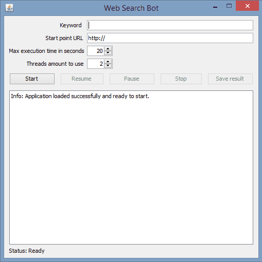
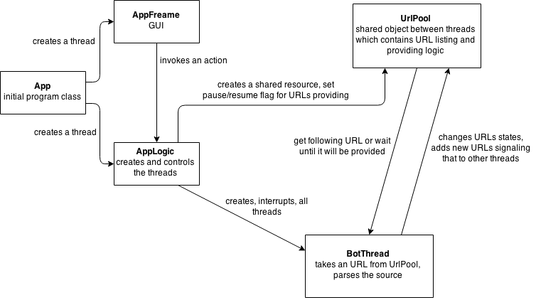

### What is it?

**Web Search Bot** is an university project to implement a simple multithreading program. It searches a given string in provided URL address and parses all the links from a web page source. All links are saved and served to the requesting bot threads to repeat the process.

### How does it look?

### How does it work?
